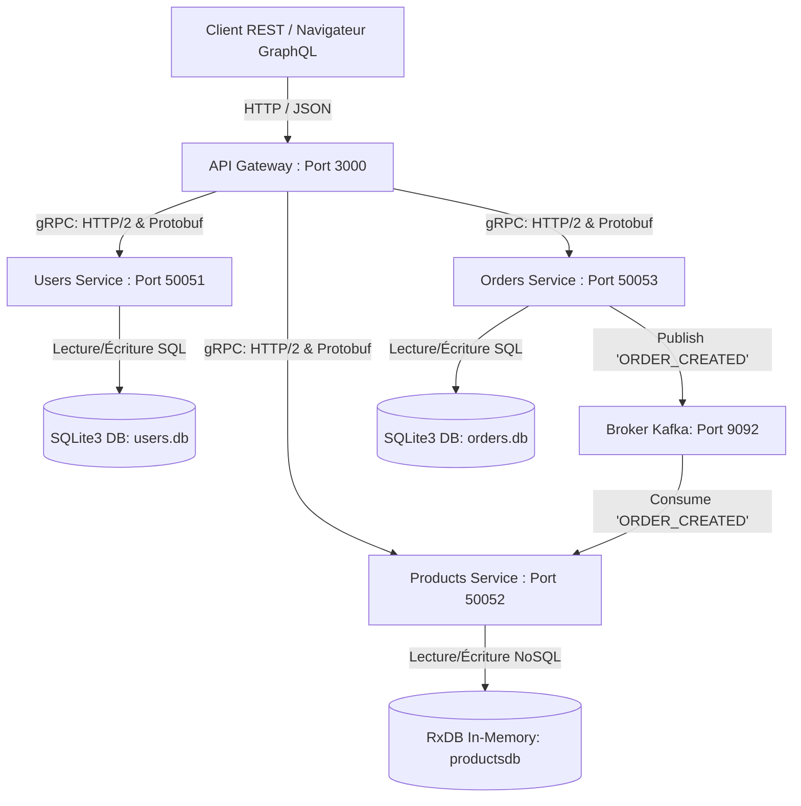

# Documentation Technique : Projet SOA Marketplace E-Commerce

Ce document fait office de guide technique complet pour comprendre l'architecture, la conception et l'exécution du projet de microservices E-Commerce développé pour l'évaluation académique SOA.

---

## 1. Schéma d’Architecture Générale

L'application respecte les principes fondamentaux de l'architecture orientée services (SOA) et des microservices : la décomposition en domaines d'affaires (Bounded Contexts), l'isolation des bases de données (Database-per-service), la communication synchrone à faible latence (gRPC) et la communication asynchrone guidée par les événements (Kafka).



### Rôles des composants :
1.  **API Gateway (Express)** : Point d'accès unique. Il valide les requêtes, orchestre les appels et sert de passerelle d'agrégation en convertissant le REST/GraphQL des clients en requêtes gRPC.
2.  **Users Service** : Responsable de la gestion des clients de la plateforme.
3.  **Products Service** : Responsable du catalogue produits et de la mise à jour des inventaires physiques.
4.  **Orders Service** : Responsable de l'enregistrement et de l'orchestration du tunnel d'achat.
5.  **Kafka (Zookeeper)** : Gère le transport d'événements asynchrones et découple les domaines de vente et de gestion de stocks.

---

## 2. Description des Bases de Données Utilisées

Conformément aux préconisations d'architectures distribuées, **chaque microservice possède sa propre base de données isolée**, interdisant les jointures directes ou l'accès aux tables d'autres services.

| Service | Type de Base de Données | Justification Architecturale |
| :--- | :--- | :--- |
| **Users Service** | **SQLite3 (Relationnelle - SQL)** | Les données d'utilisateurs nécessitent des contraintes d'intégrité strictes (ex: unicité de l'email) et bénéficient d'un schéma relationnel classique et transactionnel (ACID). |
| **Products Service** | **RxDB (NoSQL Orientée Document)** | Le catalogue de produits peut évoluer de manière dynamique (attributs variables). L'utilisation de RxDB en mémoire avec une structure de document JSON offre des performances d'indexation ultra-rapides et une flexibilité de schéma nécessaire pour un catalogue e-commerce. |
| **Orders Service** | **SQLite3 (Relationnelle - SQL)** | Les transactions d'achat doivent être hautement cohérentes (propriétés ACID strictes). Utiliser du relationnel garantit qu'aucune commande incohérente ne soit insérée et facilite le suivi de l'historique d'achat. |

---

## 3. Fichiers et Contrats de Services gRPC (.proto)

gRPC est utilisé pour toutes les communications synchrones internes de service à service en raison de sa rapidité, de sa sérialisation compacte via **Protobuf** et du multiplexage sur **HTTP/2**.

Les contrats d'interface sont situés dans le dossier `/proto` :

### 3.1. `users.proto`
Définit les méthodes pour créer un utilisateur et récupérer ses informations.
```protobuf
syntax = "proto3";
package users;

service UserService {
  rpc GetUser (GetUserRequest) returns (UserResponse);
  rpc CreateUser (CreateUserRequest) returns (UserResponse);
}

message GetUserRequest { string id = 1; }
message CreateUserRequest { string name = 1; string email = 2; }
message UserResponse { string id = 1; string name = 2; string email = 3; }
```

### 3.2. `products.proto`
Définit la gestion du catalogue et la consultation des produits.
```protobuf
syntax = "proto3";
package products;

service ProductService {
  rpc GetProduct (GetProductRequest) returns (ProductResponse);
  rpc SearchProducts (SearchProductsRequest) returns (ProductListResponse);
  rpc CreateProduct (CreateProductRequest) returns (ProductResponse);
}

message GetProductRequest { string id = 1; }
message SearchProductsRequest { string query = 1; }
message CreateProductRequest { string name = 1; string description = 2; float price = 3; int32 stock = 4; }
message ProductResponse { string id = 1; string name = 2; string description = 3; float price = 4; int32 stock = 5; }
message ProductListResponse { repeated ProductResponse products = 1; }
```

### 3.3. `orders.proto`
Définit la gestion du flux de commandes.
```protobuf
syntax = "proto3";
package orders;

service OrderService {
  rpc CreateOrder (CreateOrderRequest) returns (OrderResponse);
  rpc GetOrder (GetOrderRequest) returns (OrderResponse);
}

message CreateOrderRequest { string user_id = 1; string product_id = 2; int32 quantity = 3; }
message OrderResponse { string id = 1; string user_id = 2; string product_id = 3; int32 quantity = 4; string status = 5; }
```

---

## 4. Endpoints REST (API Gateway)

Le client communique avec l'API Gateway via des routes REST classiques. Les données d'entrée et de sortie sont au format JSON.

### 4.1. Gestion des Utilisateurs
*   **Créer un utilisateur :**
    *   `POST /users`
    *   *Request Body (JSON) :* `{ "name": "Rami Nouri", "email": "rami@example.com" }`
    *   *Response (JSON) :* `{ "id": "1", "name": "Rami Nouri", "email": "rami@example.com" }`
*   **Récupérer un utilisateur :**
    *   `GET /users/:id`
    *   *Response (JSON) :* `{ "id": "1", "name": "Rami Nouri", "email": "rami@example.com" }`

### 4.2. Gestion du Catalogue de Produits
*   **Créer un produit :**
    *   `POST /products`
    *   *Request Body (JSON) :* `{ "name": "Ordinateur", "description": "16GB RAM", "price": 999.99, "stock": 10 }`
    *   *Response (JSON) :* `{ "id": "p39dk1", "name": "Ordinateur", "description": "16GB RAM", "price": 999.99, "stock": 10 }`
*   **Lister et filtrer les produits :**
    *   `GET /products` ou `GET /products?q=Ordinateur`
    *   *Response (JSON) :* `{ "products": [ { "id": "p39dk1", "name": "Ordinateur", ... } ] }`

### 4.3. Gestion des Commandes
*   **Passer une commande :**
    *   `POST /orders`
    *   *Request Body (JSON) :* `{ "user_id": "1", "product_id": "p39dk1", "quantity": 2 }`
    *   *Response (JSON) :* `{ "id": "o83l9a", "user_id": "1", "product_id": "p39dk1", "quantity": 2, "status": "PENDING" }`
*   **Consulter une commande :**
    *   `GET /orders/:id`

---

## 5. Description du Schéma GraphQL (API Gateway)

GraphQL est implémenté en parallèle de REST pour fournir une passerelle d'agrégation souple. Cela permet aux clients Web/Mobile de récupérer exactement les attributs dont ils ont besoin en une seule requête HTTP POST, prévenant le sur-récupération (over-fetching).

### Justification de l'utilisation de GraphQL
*   **Requêtes flexibles** : Le client choisit les attributs à retourner.
*   **Point d'accès consolidé** : Simplifie l'intégration du client mobile en réduisant le nombre d'allers-retours vers le réseau.

Le schéma complet déclaré dans la passerelle est le suivant :

```graphql
type User {
  id: String!
  name: String!
  email: String!
}

type Product {
  id: String!
  name: String!
  description: String!
  price: Float!
  stock: Int!
}

type Order {
  id: String!
  user_id: String!
  product_id: String!
  quantity: Int!
  status: String!
}

type Query {
  getUser(id: String!): User
  getProduct(id: String!): Product
  getProducts: [Product]
  getOrder(id: String!): Order
}

type Mutation {
  createUser(name: String!, email: String!): User
  createProduct(name: String!, description: String!, price: Float!, stock: Int!): Product
  createOrder(user_id: String!, product_id: String!, quantity: Int!): Order
}
```

---

## 6. Communication Asynchrone : Topics et Événements Kafka

Pour assurer l'autonomie et le couplage faible entre le service de commande (`orders-service`) et de catalogue (`products-service`), les mises à jour d'inventaires sont faites de manière asynchrone via un broker de messages Apache Kafka.

### Description des flux événementiels
*   **Topic utilisé** : `order-events`
*   **Producteur** : `orders-service` (dès qu'une commande est créée, elle est poussée dans le topic en tant que message sérialisé JSON).
*   **Consommateur** : `products-service` (abonnée permanente au topic `order-events`). Elle traite chaque commande entrante pour réduire le stock physiquement en base NoSQL.

### Structure du message (`ORDER_CREATED`) :
```json
{
  "type": "ORDER_CREATED",
  "orderId": "o83l9a",
  "productId": "p39dk1",
  "userId": "1",
  "quantity": 2,
  "timestamp": "2026-05-19T08:00:00.000Z"
}
```

---

## 7. Guide d'Installation et d'Exécution

### 7.1. Prérequis
Assurez-vous d'avoir installé sur votre machine :
*   **Node.js** (v18+)
*   **Docker Desktop** (avec le démon Docker démarré)

### 7.2. Démarrage de l'infrastructure Kafka
Depuis la racine du projet (`projet-soa`), démarrez le broker Kafka et Zookeeper dans Docker :
```bash
docker compose up -d
```
Attendez 15 secondes le temps que les services s'initialisent.

### 7.3. Installation des Dépendances Node.js
Pour installer proprement les modules `node_modules` de tous les services, lancez les commandes suivantes depuis la racine du projet :
```powershell
# Installer les dépendances pour chaque service
cd users-service; npm install; cd ..
cd products-service; npm install; cd ..
cd orders-service; npm install; cd ..
cd api-gateway; npm install; cd ..
```

### 7.4. Lancement Global de l'Application
Pour lancer l'intégralité du projet en une seule action (ce qui démarrera l'API Gateway et les 3 microservices dans des fenêtres de terminal distinctes) :

*   **Sur Windows :** Double-cliquez sur le script **`start-all.bat`** (ou lancez `.\start-all.bat` dans votre console).
*   **Sur macOS / Linux :** Ouvrez 4 terminaux séparés et lancez `node index.js` à l'intérieur de chacun des sous-répertoires (`users-service`, `products-service`, `orders-service`, `api-gateway`).

Les points d'accès disponibles seront :
*   **Portail REST :** `http://localhost:3000`
*   **Apollo GraphQL Sandbox :** `http://localhost:3000/graphql`
